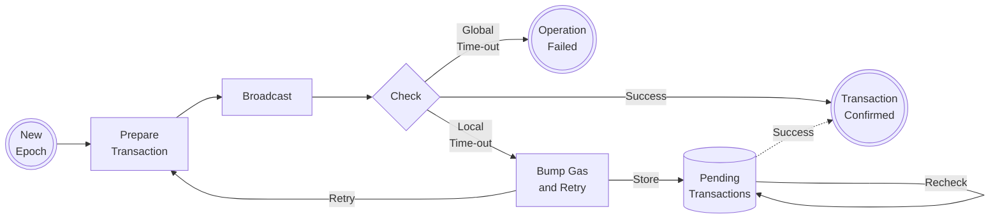

# Transaction Monitoring

```mermaid
flowchart LR
    %% Definitions
    newEpoch(((New\nEpoch)))
    success(((Transaction\nConfirmed)))
    fail(((Operation\nFailed)))
    prepare[Prepare\nTransaction]
    pending[(Pending\nTransactions)]
    broadcast[Broadcast]
    check{Check}
    bump[Bump Gas\nand Retry]

    %% Connections
    newEpoch --> prepare --> broadcast
    broadcast --> check
    check -- "Local\nTime-out" --> bump
    pending -- Recheck--> pending
    bump -- Store --> pending
    bump -- Retry --> prepare
    check -- Success --> success
    check -- "Global\nTime-out" --> fail
    pending -. Success .-> success
```
